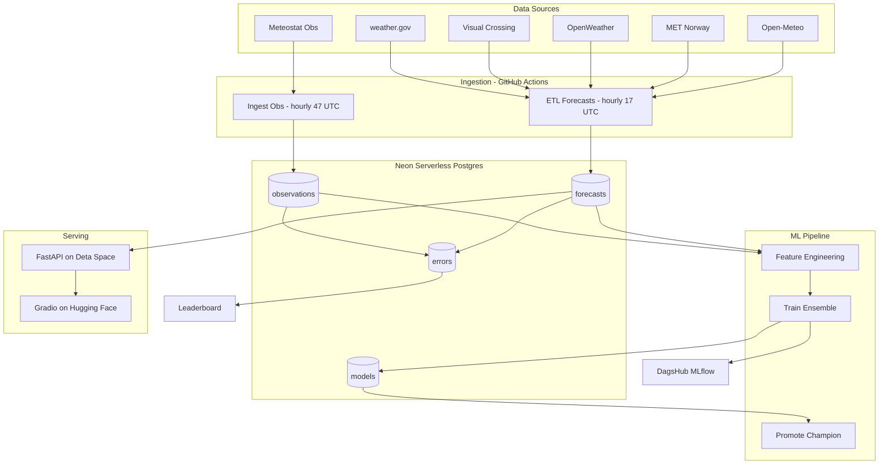
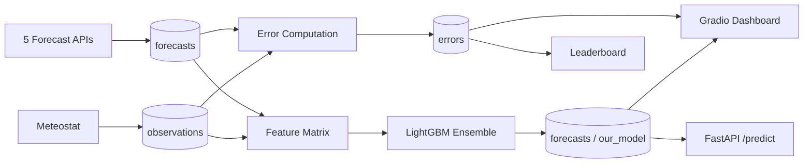
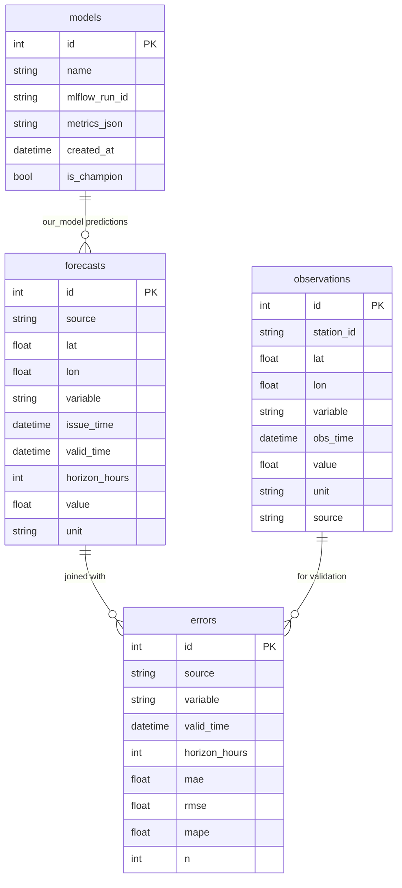

# Weather MLOps: Multi-API Forecast Verification + Ensemble

[](https://jepstar990.github.io/weather-mlops-forecasts/)
[](LICENSE)
[](https://www.python.org/downloads/)
[](https://github.com/JepStar990/weather-mlops-forecasts/actions)

An end-to-end, production-grade MLOps system to ingest hourly weather forecasts from multiple providers, ingest observed weather, measure forecast error per source/horizon/variable, train and promote our own ensemble model, and serve predictions via FastAPI with a Gradio verification dashboard.

> **Portfolio Landing Page**: [jepstar990.github.io/weather-mlops-forecasts/](https://jepstar990.github.io/weather-mlops-forecasts/)

---

## Architecture



## Pipeline Schedule

| Workflow | Schedule (UTC) | What It Does |
|---|---|---|
| `etl.yml` | Hourly :17 | Ingest forecasts from all 5 providers |
| `predict.yml` | Hourly :27 | Run ensemble model inference |
| `monitor.yml` | Hourly :37 | Log leaderboard + data volume |
| `verify.yml` | Hourly :47 | Ingest observations + compute errors |
| `train.yml` | Daily 03:17 | Train ensemble + promote champion |
| `prune.yml` | Daily 03:07 | Delete expired data (retention TTL) |

All staggered off the hour to reduce GitHub Actions queue congestion.

## Data Flow



## All Free Tiers

| Component | Provider | Free Tier Limit |
|---|---|---|
| Forecast APIs | Open-Meteo, MET Norway, NWS | No key needed |
| Forecast APIs | OpenWeather, Visual Crossing | ~1,000 calls/day |
| Observations | Meteostat Python library | CC BY-NC |
| Warehouse | Neon Serverless Postgres | 0.5 GB, 100 compute hrs |
| Experiment Tracking | DagsHub MLflow | Free for public repos |
| Serving API | Deta Space | Free micro |
| Dashboard | Hugging Face Spaces | Free Gradio |
| Orchestration | GitHub Actions | 2,000 min/month |
| Docs | GitHub Pages | Free |

## Required Environment Variables

| Variable | Required | Description |
|---|---|---|
| `DATABASE_URL` | Yes | Neon Postgres connection string |
| `MET_NO_USER_AGENT` | Yes | e.g. `your-app/0.1 (email@example.com)` |
| `NWS_USER_AGENT` | Yes | Same format |
| `OPENWEATHER_API_KEY` | No | 1,000 calls/day free |
| `VISUAL_CROSSING_API_KEY` | No | ~1,000 records/day free |
| `DAGSHUB_USERNAME` | No | For MLflow tracking |
| `DAGSHUB_TOKEN` | No | For MLflow tracking |
| `PUBLIC_REPO_NAME` | No | Default: `weather-mlops-forecasts` |
| `TARGET_LOCATIONS` | Yes | JSON array of `[{"name":"...","lat":...,"lon":...}]` |
| `VARIABLES` | Yes | `["temp_2m","wind_speed_10m","precipitation"]` |
| `HORIZONS_HOURS` | Yes | `[1,3,6,12,24,48,72]` |
| `LOCAL_TIMEZONE` | No | Default: `Africa/Johannesburg` |

## Quickstart

```bash
python -m venv .venv && source .venv/bin/activate
pip install -r requirements.txt

cp .env.example .env
# Edit .env with your DATABASE_URL, keys, DagsHub creds, etc.

# Bootstrap DB
psql $DATABASE_URL -f src/db/schema.sql
python scripts/seed_locations.py

# Smoke test
python src/etl/ingest_open_meteo.py
```

## Database Schema



## API Endpoints

| Endpoint | Method | Description |
|---|---|---|
| `/health` | GET | Health check |
| `/sources` | GET | Error metrics per source (7 days) |
| `/metrics` | GET | Leaderboard: best source per variable/horizon |
| `/predict` | POST | Ensemble predictions for lat/lon/variables/horizons |

## Deployment

### Neon (DB)
1. Create a Neon project (free), obtain `DATABASE_URL`
2. Run `src/db/schema.sql`
3. Optionally create a read-only role for dashboards

### DagsHub (MLflow)
1. Create a public repo named `weather-mlops-forecasts`
2. Generate a token; set `DAGSHUB_USERNAME` & `DAGSHUB_TOKEN`
3. MLflow tracking URI: `https://dagshub.com/<user>/<repo>.mlflow`

### Hugging Face Spaces (Gradio Dashboard)
1. New Space (Gradio). Copy `src/serve/dashboard/app.py` + minimal utils + `requirements.txt`
2. Set `DATABASE_URL` secret (read-only)
3. First charts render after data arrives

### Deta Space (FastAPI)
1. Create a Deta Space project
2. Add `src/serve/api/main.py` and `requirements.txt`
3. Set `DATABASE_URL`
4. Start: `uvicorn src.serve.api.main:app --host 0.0.0.0 --port 8000`

### GitHub Pages (Documentation)
1. Go to repo Settings → Pages
2. Source: Deploy from branch → `main` → `/docs` folder
3. Landing page available at `https://<user>.github.io/weather-mlops-forecasts/`

## Data Retention

To stay within Neon free-tier limits (~0.5 GB):
- **Forecasts**: 14-day retention (configurable via `FORECAST_RETENTION_DAYS`)
- **Observations**: 90-day retention
- **Errors**: 90-day retention
- Only configured `HORIZONS_HOURS` are stored (not all API-returned hours)
- Daily prune job runs at 03:07 UTC

## Project Structure

```
weather-mlops-forecasts/
├── .github/workflows/        # 6 CI workflows
│   ├── etl.yml               # Hourly forecast ingestion
│   ├── verify.yml            # Hourly obs + error compute
│   ├── predict.yml           # Hourly ensemble inference
│   ├── monitor.yml           # Hourly leaderboard + volume
│   ├── train.yml             # Daily train + promote
│   └── prune.yml             # Daily data retention cleanup
├── src/
│   ├── config.py             # All configuration
│   ├── db/
│   │   ├── schema.sql        # Postgres schema
│   │   └── prune.py          # Data retention pruning
│   ├── etl/                  # 5 forecast + 1 observation ingestors
│   ├── model/
│   │   ├── features.py       # Feature engineering
│   │   ├── train.py          # Model training (LightGBM + Linear)
│   │   ├── predict.py        # Batch inference
│   │   ├── evaluate.py       # Weekly CV evaluation
│   │   └── promote.py        # Champion-challenger promotion
│   ├── verify/
│   │   ├── compute_errors.py # Forecast-obs error computation
│   │   └── leaderboard.py    # Best-source ranking
│   ├── jobs/                 # Job entry points
│   ├── serve/
│   │   ├── api/main.py       # FastAPI prediction API
│   │   └── dashboard/app.py  # Gradio verification dashboard
│   └── utils/                # HTTP, DB, time, unit, logging
├── docs/
│   └── index.html            # Portfolio landing page
├── scripts/                  # Bootstrap + seed scripts
├── requirements.txt
└── README.md
```

## Attribution & Data Licenses

- **Open-Meteo** (free, no key; non-commercial): https://open-meteo.com/
- **MET Norway Locationforecast 2.0** (User-Agent required): https://api.met.no/
- **weather.gov** (NWS API): https://www.weather.gov/documentation/services-web-api
- **OpenWeather One Call 3.0** (1,000 calls/day free): https://openweathermap.org/
- **Visual Crossing** (free tier): https://www.visualcrossing.com/
- **Meteostat** (observations; CC BY-NC): https://pypi.org/project/meteostat/

**License**: MIT (with attribution to data providers above).
